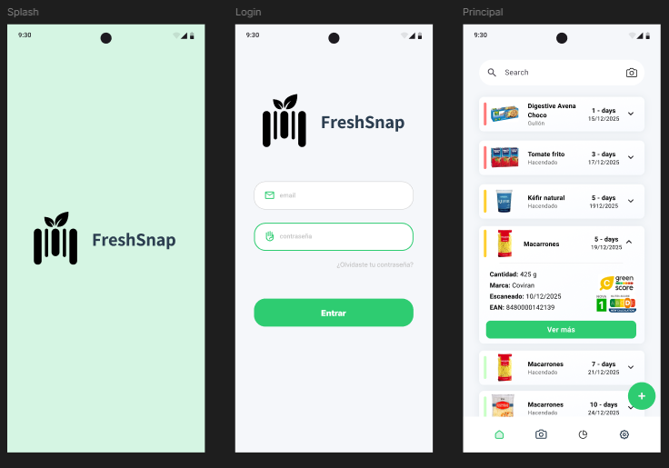
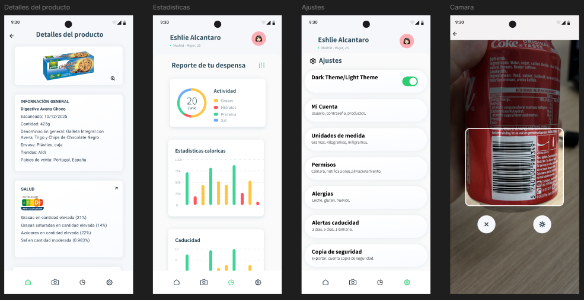
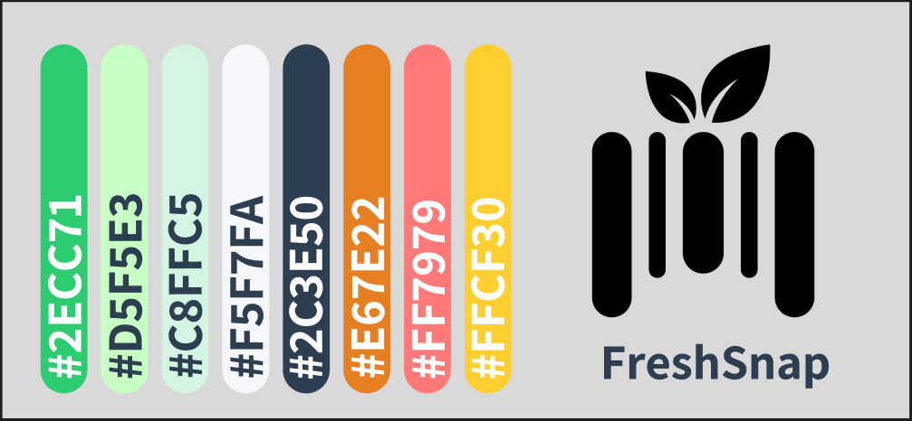

  <picture>
    <source media="(prefers-color-scheme: dark)" srcset="./Resources/FreshSnap_white.svg">
    <source media="(prefers-color-scheme: light)" srcset="./Resources/FreshSnap.svg">
    
  </picture>

<h1 align="center">FreshSnap (FreshApp)</h1>

  <strong>Tu despensa online</strong>

  <a href="#-características">Características</a> •
  <a href="#-capturas-de-pantalla">Capturas</a> •
  <a href="#-diseño">Diseño</a> •
  <a href="#-instalación">Instalación</a>

---

## Descripción

**FreshSnap** es una aplicación móvil diseñada para ayudarte a reducir el desperdicio de alimentos y mantener un estilo de vida saludable. La app permite gestionar tu despensa de forma automatizada mediante el escaneo de códigos de barras, ofreciendo información detallada sobre la calidad nutricional de los productos y alertándote sobre sus fechas de caducidad.

### ¿Qué hace FreshSnap por ti?
* **Gestión de Despensa:** Visualiza qué tienes en casa y cuánto tiempo le queda de vida útil.
* **Análisis Nutricional:** Obtén al instante el Nutri-Score, ingredientes y advertencias de alérgenos.
* **Hábitos Saludables:** Monitorea tu consumo de grasas, hidratos y proteínas mediante gráficos intuitivos.

---

## Capturas de Pantalla

<table align="center" style="border: none;">
  <tr>
    <td align="center" style="border: none;">
      <strong>Inicio y Login</strong> 
      
    </td>
    <td align="center" style="border: none;">
      <strong>Detalles y Escáner</strong> 
      
    </td>
  </tr>
</table>

---

## Características Principales

### 1. Escáner Inteligente y Detalles del Producto
* **Escaneo de Código de Barras:** Utiliza la cámara para identificar productos.
* **Información Detallada:** Muestra el nombre, marca, cantidad e ingredientes.
* **Nutri-Score y Salud:** Visualiza claramente la puntuación nutricional (A-E) y el desglose de grasas, azúcares y sal.

### 2. Control de Caducidad
* **Alertas Visuales:** En la pantalla principal, cada producto muestra una cuenta de los dias restantes para que los alimentos caduquen.
* **Organizacion por colores**
    * 🔴 Rojo: Caduca en 1-3 días.
    * 🟡 Amarillo: Caduca pronto (3-5 días).
    * 🟢 Verde: Fresco (+7 días).
* **Configuración de Alertas:** Personaliza cuándo quieres recibir notificaciones (3 días antes, 1 semana antes, etc.) desde los ajustes.

### 3. Estadísticas y Reportes
* **Desglose de Dieta:** Gráfico circular que muestra el balance de tu despensa (Grasas, Hidratos, Proteínas, Sal).
* **Histórico Calórico:** Gráficas de barras para controlar la ingesta calórica y el volumen de productos próximos a caducar.

### 4. Personalización y Ajustes
* **Modo Oscuro/Claro:** Opcion para cambiar de tema.
* **Filtros de Alergias:** Configura tu perfil para alertar sobre leche, gluten, huevos, etc.
* **Gestión de Cuenta:** Unidades de medida personalizables.

---

## Diseño y Paleta de Colores

---
