

  <picture>
    <source media="(prefers-color-scheme: dark)" srcset="./Resources/FreshSnap_white.svg">
    <source media="(prefers-color-scheme: light)" srcset="./Resources/FreshSnap.svg">
    
  </picture>

<h1 align="center">FreshSnap</h1>

  <strong>Gestor inteligente de despensa y control de calidad nutricional</strong>

  <a href="#descripción">Descripción</a> •
  <a href="#características-principales">Características</a> •
  <a href="#galería-de-interfaz">Interfaz</a> •
  <a href="#arquitectura-y-tecnologías">Tecnologías</a> •
  <a href="#instalación">Instalación</a>

---

## Descripción

**FreshSnap** es una aplicación móvil nativa para el ecosistema Android orientada a optimizar la gestión de inventario de alimentos en el hogar. Su objetivo principal es mitigar el desperdicio alimentario mediante el monitoreo automatizado de fechas de caducidad y promover decisiones de consumo informadas mediante el análisis nutricional en tiempo real.

El sistema utiliza algoritmos de visión artificial integrados localmente en el dispositivo para la lectura de códigos de barras y el reconocimiento óptico de caracteres (OCR) para la extracción de fechas impresas en los envases.

---

## Características Principales

### 1. Escáner Inteligente Dual
* **Reconocimiento de Códigos de Barras:** Implementación de Google ML Kit sobre CameraX para la detección instantánea de formatos EAN-13, EAN-8 y UPC.
* **Extracción de Fechas por OCR:** Escaneo de texto en tiempo real con procesamiento mediante expresiones regulares (RegEx) para identificar y estructurar automáticamente las fechas de caducidad de los envases.

### 2. Análisis Nutricional Detallado
* **Integración API REST:** Conexión asíncrona con la base de datos de OpenFoodFacts.
* **Métricas de Salud:** Representación visual del Nutri-Score y Eco-Score.
* **Desglose de Macronutrientes:** Listado de valores por 100g (energía, grasas, carbohidratos, proteínas, sal, etc.) con categorización de niveles de riesgo (Bajo, Moderado, Alto).

### 3. Gestión de Inventario Avanzada
* **Categorización Dinámica:** Visualización dividida mediante pestañas reactivas (Despensa activa, Productos Caducados y Consumidos).
* **Indicadores Visuales:** Barras de estado laterales que cambian dinámicamente según la proximidad de la fecha de caducidad.
* **Interacciones Gestuales:** Soporte para acciones "Swipe-to-Dismiss" para consumir o eliminar registros rápidamente.

### 4. Sincronización y Notificaciones Locales
* **Trabajos en Segundo Plano:** Uso de WorkManager para evaluar el estado del inventario diariamente de forma eficiente respecto a la batería.
* **Alertas Push:** Generación de notificaciones locales de alta prioridad cuando los productos entran en su ventana crítica de caducidad.
* **Persistencia en la Nube:** Sincronización en tiempo real de los datos del usuario utilizando Firebase Firestore.

---

## Galería de Interfaz

La aplicación cuenta con una interfaz de usuario completamente declarativa construida con Jetpack Compose y adaptada a las directrices de Material Design 3, incluyendo soporte integral para modo claro y modo oscuro.

### Flujo Principal de la Aplicación

<table align="center" style="border: none;">
  <tr>
    <td align="center" style="border: none;">
      <strong>Inventario Principal</strong> 
      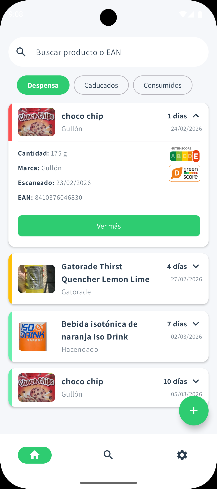
    </td>
    <td align="center" style="border: none;">
      <strong>Escáner (CameraX)</strong> 
      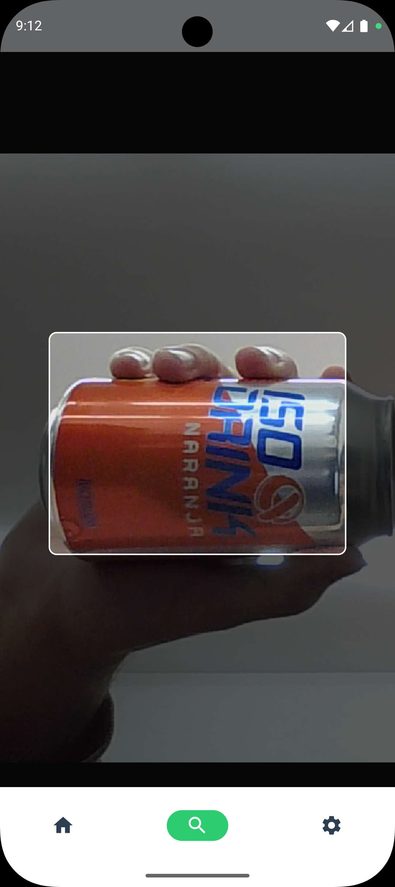
    </td>
    <td align="center" style="border: none;">
      <strong>Detalles del Producto</strong> 
      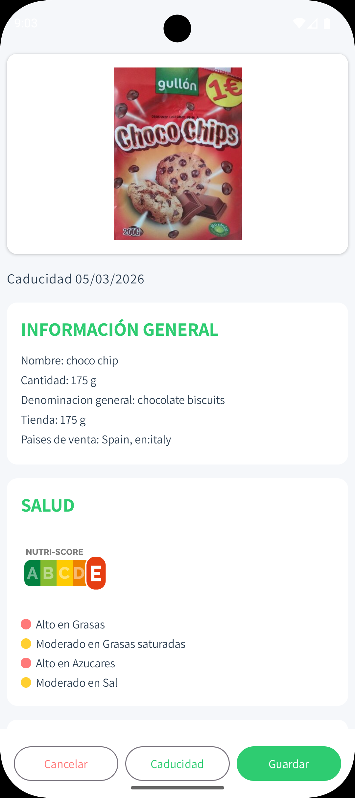
    </td>
    <td align="center" style="border: none;">
      <strong>Notificaciones</strong> 
      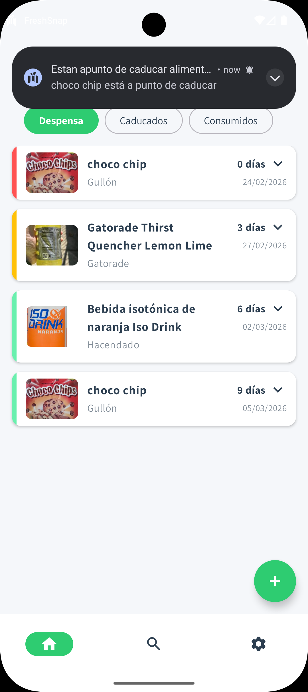
    </td>
  </tr>
</table>

### Funcionalidades Adicionales

<table align="center" style="border: none;">
  <tr>
    <td align="center" style="border: none;">
      <strong>Valores Nutricionales</strong> 
      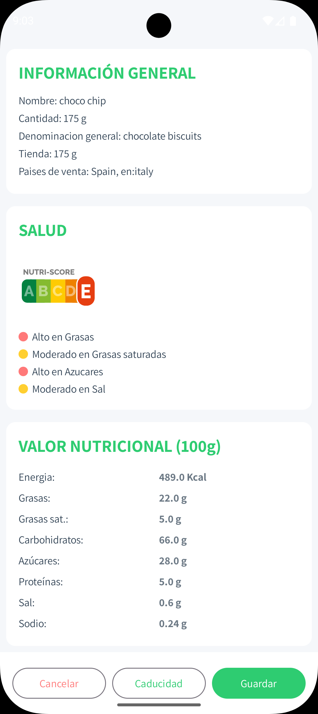
    </td>
    <td align="center" style="border: none;">
      <strong>Histórico de Consumidos</strong> 
      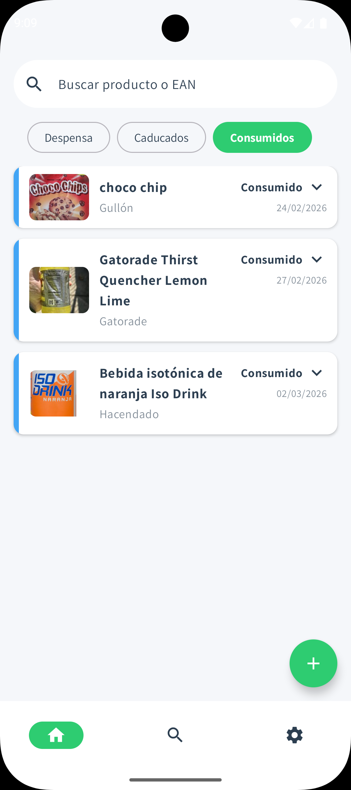
    </td>
    <td align="center" style="border: none;">
      <strong>Ajustes del Sistema</strong> 
      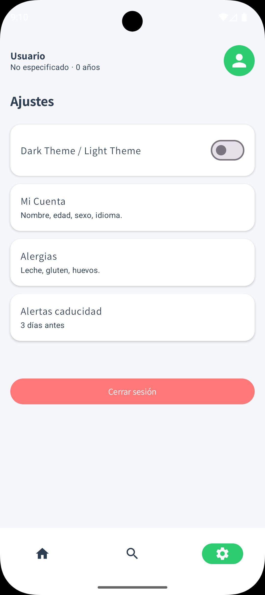
    </td>
    <td align="center" style="border: none;">
      <strong>Ingreso Manual (Selector)</strong> 
      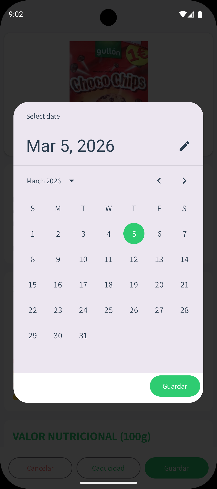
    </td>
  </tr>
</table>

### Soporte de Modo Oscuro (Dark Theme)

La interfaz se adapta automáticamente a las preferencias del sistema o a la configuración manual del usuario gestionada a través de Preferences DataStore.

<table align="center" style="border: none;">
  <tr>
    <td align="center" style="border: none;">
      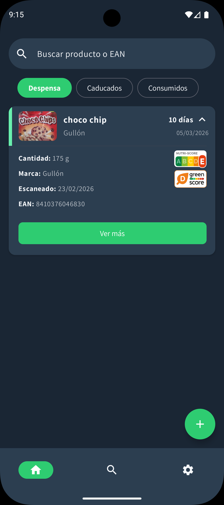
    </td>
    <td align="center" style="border: none;">
      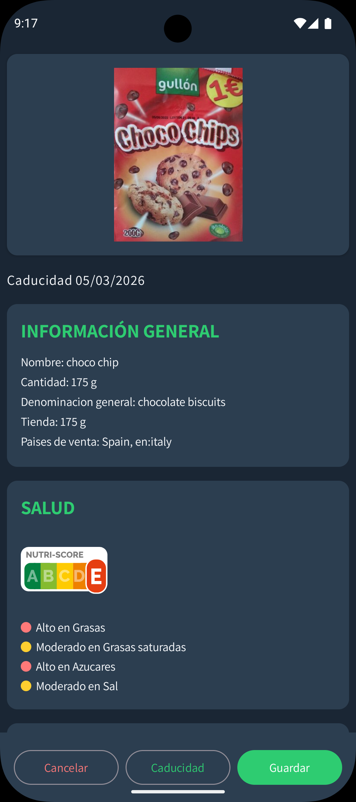
    </td>
    <td align="center" style="border: none;">
      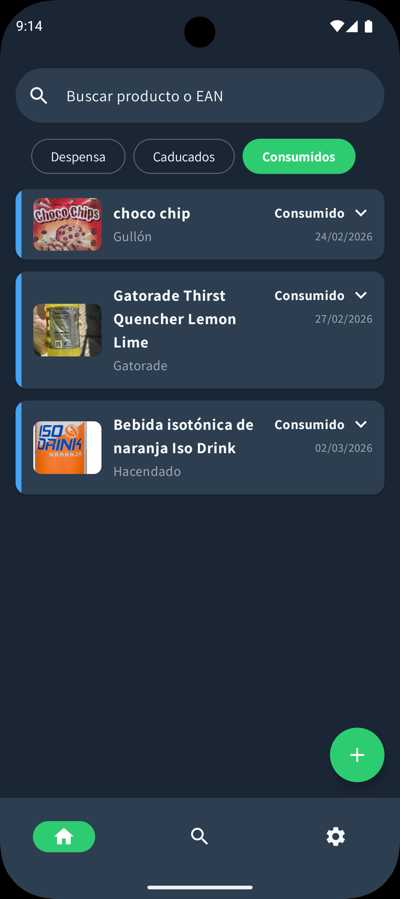
    </td>
    <td align="center" style="border: none;">
      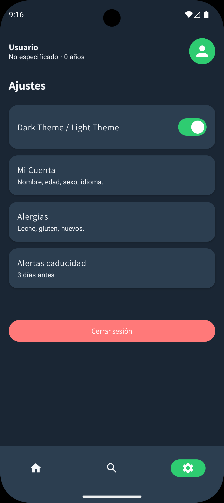
    </td>
  </tr>
</table>

---

## Arquitectura y Tecnologías

El repositorio sigue una arquitectura de software basada en el patrón **Model-View-ViewModel (MVVM)** combinado con principios de **Clean Architecture**, asegurando una clara separación de responsabilidades.

### Stack Técnico
* **UI y Navegación:** Jetpack Compose, Compose Navigation.
* **Lenguaje:** Kotlin (Coroutines, Flow/StateFlow).
* **Inyección de Dependencias:** Dagger Hilt.
* **Red y Serialización:** Retrofit 2, Moshi.
* **Visión Artificial:** Google ML Kit (Barcode Scanning, Text Recognition), Android CameraX.
* **Backend como Servicio (BaaS):** Firebase Authentication, Firebase Cloud Firestore.
* **Trabajos Diferidos:** Android Jetpack WorkManager.
* **Almacenamiento Local:** Preferences DataStore.
* **Carga de Imágenes:** Coil.
